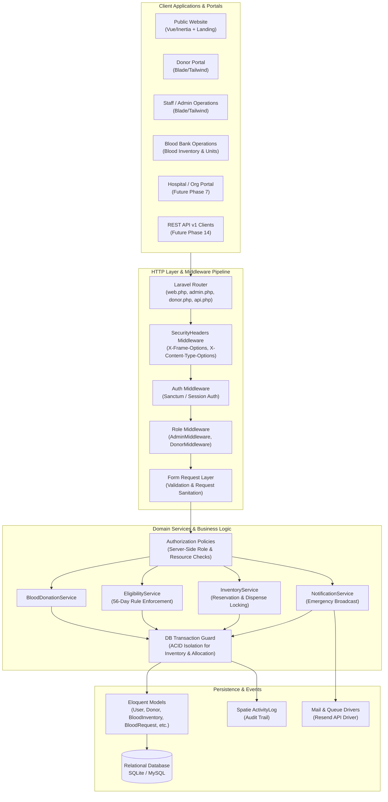

# System Architecture & Technical Specification

**Application**: LifeBlood Blood Bank & Donor Operations Platform  
**Framework**: Laravel 11.x (PHP 8.2+)  
**Frontend Architecture**: Hybrid Vue 3 / Inertia.js (Public & Auth) + Blade Templates with Tailwind CSS (Admin & Donor Portals)  
**Database**: SQLite (Local Dev/Testing) / MySQL 8.0+ / PostgreSQL (Production)  

---

## 1. High-Level Architectural Diagram



---

## 2. Standardized Request Lifecycle Specification

Every state-modifying or privileged operation in the platform follows a strict 11-step pipeline:

```text
Route 
  ↓
Authentication Middleware (auth, verified)
  ↓
Authorization Middleware / Policy ($this->authorize(...) / Gates)
  ↓
Form Request Validation (Server-side validation & payload sanitization)
  ↓
Service Layer / Business Logic (Pure PHP Domain Service, Thin Controllers)
  ↓
Database Transaction (DB::transaction(...) for multi-step mutations)
  ↓
Model Layer / Persistence (Eloquent mutations & mass-assignment protection)
  ↓
Audit Logging (Spatie activity() audit trail recorded)
  ↓
Notification Dispatch (Email/Database emergency broadcasts)
  ↓
Automated Verification (Feature & Unit Test Coverage)
```

### Separation of Concerns Rules:
1. **Controllers**: Must remain thin (<30 lines per method). Responsible only for delegating input to Form Requests/Services and returning HTTP responses/views.
2. **Form Requests**: All POST/PUT/PATCH validation logic must reside in dedicated `Illuminate\Foundation\Http\FormRequest` classes.
3. **Services**: Complex business logic (eligibility calculation, inventory allocation, status transitions) must be encapsulated in domain services (`app/Services/...`).
4. **Policies**: All resource access rules must be evaluated via Laravel Policies (`app/Policies/...`).
5. **Transactions**: Any operation modifying multiple tables (e.g. approving request + reserving inventory + logging activity) MUST be wrapped in `DB::transaction()`.

---

## 3. Core Modules & Target Capabilities

| Module | Current State | Target State |
| :--- | :--- | :--- |
| **1. Public Website** | Vue/Inertia landing page (`Welcome.vue`) | Responsive public portal with live blood shortage urgency banners, donor registration CTA, and hospital emergency contact. |
| **2. Donor Portal** | Blade dashboard, profile edit, appointment booking (with 56-day check), blood request submission. | Enhanced donor dashboard with donation milestone badges, digital donor card, eligibility countdown clock, and appointment rescheduling. |
| **3. Staff/Admin Ops** | Blade dashboard, donor management, appointment management, basic inventory, user management, activity log viewer, 2FA. | Multi-role staff portal with granular RBAC (SuperAdmin, Lab Technician, Inventory Manager, Phlebotomist). |
| **4. Blood Bank Ops** | Generic blood inventory count per group. | Unit-level barcode/ISBT-128 tracking, component separation (Whole Blood, PRBC, Platelets, FFP), refrigeration temp logs, and expiration tracking. |
| **5. Hospital Portal** | Non-existent (Donors currently request blood directly). | Dedicated hospital dashboard to submit requisition orders, track fulfillment status, and confirm receipt of blood bags. |
| **6. Reporting & Analytics**| Basic stats and monthly donation counts. | Real-time analytics, inventory waste reports, donor retention metrics, and exportable PDF/Excel compliance reports. |
| **7. Notifications** | Mail & Database emergency request notifications via Resend API. | Multi-channel notifications (SMS/WhatsApp integration capability, push, email, in-app alerts). |
| **8. Security & Audit** | 2FA for admins, SecurityHeaders, Spatie activity logging, rate limiting. | Audit logging for all PHI (Protected Health Information) access, IP restriction for staff login, and session timeout policy. |
| **9. API Readiness** | Default Sanctum `/api/user` route. | Versioned REST API (`/api/v1/...`) with Sanctum token authentication for mobile app integration and partner hospital EHR systems. |
| **10. Testing & CI/CD** | 34 PHPUnit feature/unit tests. | >90% code coverage, automated GitHub Actions workflow for linting, security scanning, and automated deployment. |
