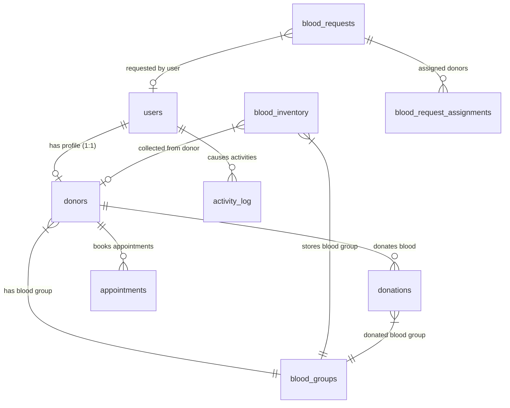

# Database Schema Audit & Data Architecture

**Application**: LifeBlood Blood Bank & Donor Operations Platform  
**Database**: SQLite (Development & Unit Testing) / MySQL 8.0+ (Production)  

---

## 1. Complete Database Entity Directory (12 Active Tables)

### Table 1: `users`
- **Columns**: `id` (BIGINT PK), `name` (VARCHAR), `email` (VARCHAR UNIQUE), `email_verified_at` (TIMESTAMP null), `password` (VARCHAR), `role` (VARCHAR default 'donor'), `status` (VARCHAR default 'active'), `google2fa_secret` (VARCHAR null), `google2fa_enabled` (BOOLEAN default false), `two_factor_recovery_codes` (TEXT null), `remember_token`, `created_at`, `updated_at`.
- **Indexes**: Primary key `id`, Unique index `email`.
- **Security**: Mass-assignment protected (`role` is excluded from `$fillable`).

### Table 2: `donors`
- **Columns**: `id` (BIGINT PK), `user_id` (FK -> `users.id` CASCADE), `blood_group_id` (FK -> `blood_groups.id`), `gender` (ENUM/VARCHAR), `date_of_birth` (DATE), `contact_number` (VARCHAR), `address` (TEXT), `city` (VARCHAR), `state` (VARCHAR), `zip_code` (VARCHAR), `last_donation_date` (DATE null), `status` (VARCHAR default 'active'), `is_available` (BOOLEAN default true), `created_at`, `updated_at`.
- **Indexes**: Primary key `id`, FK `user_id`, FK `blood_group_id`, Index on `(blood_group_id, is_available, status)`.

### Table 3: `blood_groups`
- **Columns**: `id` (BIGINT PK), `name` (VARCHAR UNIQUE, e.g. 'A+', 'O-'), `description` (TEXT null), `created_at`, `updated_at`.

### Table 4: `blood_inventory`
- **Columns**: `id` (BIGINT PK), `blood_group_id` (FK -> `blood_groups.id`), `donor_id` (FK -> `donors.id` null), `quantity` (INT in ml), `units_available` (INT default 0), `units_requested` (INT default 0), `collection_date` (DATE), `expiry_date` (DATE), `status` (VARCHAR: 'available', 'reserved', 'used', 'expired'), `storage_location` (VARCHAR null), `created_at`, `updated_at`.

### Table 5: `blood_requests`
- **Columns**: `id` (BIGINT PK), `user_id` (FK -> `users.id` null), `patient_name` (VARCHAR), `blood_group` (VARCHAR), `units_needed` (INT), `hospital` (VARCHAR), `hospital_address` (TEXT null), `city` (VARCHAR), `contact_person` (VARCHAR), `contact_number` (VARCHAR), `urgency` (VARCHAR: 'normal', 'urgent', 'emergency'), `reason` (TEXT null), `required_date` (DATE), `status` (VARCHAR: 'pending', 'approved', 'rejected', 'assigned', 'fulfilled', 'dispensed'), `admin_notes` (TEXT null), `rejection_reason` (TEXT null), `approved_by` (FK -> `users.id` null), `approved_at` (TIMESTAMP null), `fulfilled_at` (TIMESTAMP null), `dispensed_at` (TIMESTAMP null), `created_at`, `updated_at`.

### Table 6: `donations`
- **Columns**: `id` (BIGINT PK), `donor_id` (FK -> `donors.id`), `blood_group_id` (FK -> `blood_groups.id`), `quantity` (INT default 450), `donation_date` (DATE), `status` (VARCHAR: 'completed', 'testing', 'rejected'), `collection_center` (VARCHAR null), `created_by` (FK -> `users.id` null), `notes` (TEXT null), `created_at`, `updated_at`.

### Table 7: `appointments`
- **Columns**: `id` (BIGINT PK), `donor_id` (FK -> `donors.id`), `appointment_date` (DATETIME), `time_slot` (VARCHAR null), `units_to_donate` (INT default 1), `status` (VARCHAR: 'scheduled', 'completed', 'cancelled', 'no_show'), `notes` (TEXT null), `created_at`, `updated_at`.

### Table 8: `activity_log` (Spatie Package Schema)
- **Columns**: `id` (BIGINT PK), `log_name` (VARCHAR), `description` (TEXT), `subject_type` (VARCHAR null), `subject_id` (BIGINT null), `causer_type` (VARCHAR null), `causer_id` (BIGINT null), `properties` (JSON/TEXT), `event` (VARCHAR null), `batch_uuid` (UUID null), `created_at`, `updated_at`.

### Table 9: `blood_request_assignments`
- **Columns**: `id` (BIGINT PK), `blood_request_id` (FK -> `blood_requests.id`), `donor_id` (FK -> `donors.id`), `status` (VARCHAR: 'assigned', 'contacted', 'accepted', 'declined'), `created_at`, `updated_at`.

### Table 10: `notifications`
- **Columns**: `id` (UUID PK), `type` (VARCHAR), `notifiable_type` (VARCHAR), `notifiable_id` (BIGINT), `data` (TEXT/JSON), `read_at` (TIMESTAMP null), `created_at`, `updated_at`.

### Table 11: `system_settings`
- **Columns**: `id` (BIGINT PK), `key` (VARCHAR UNIQUE), `value` (TEXT null), `description` (VARCHAR null), `created_at`, `updated_at`.

### Table 12: `admins` (Legacy Table — To be deprecated in Phase 2)
- **Columns**: `id` (BIGINT PK), `user_id` (FK -> `users.id`), `department` (VARCHAR null), `created_at`, `updated_at`.

---

## 2. Identified Database Weaknesses & Gaps

| Category | Weakness Identified | Impact | Recommended Fix (Phase 2) |
| :--- | :--- | :--- | :--- |
| **Unit-Level Tracking** | `blood_inventory` tracks aggregate quantities per row rather than individual blood bag barcode units. | Unable to perform ISBT-128 barcode tracking or track single bag expiration & cross-matching. | Add `blood_units` table with unique `bag_serial_number`, `component_type` (PRBC, Platelets, FFP), and `test_status`. |
| **Hospital Entity** | `blood_requests.hospital` stores hospital names as raw unindexed text strings. | High data duplication, typo risks, no hospital user login capability. | Create `hospitals` and `hospital_users` tables. |
| **Multi-Branch Support** | All donations and inventory belong to a single global entity. | Cannot support multi-center blood banks or branch filtering. | Add `branches` table and `branch_id` foreign keys to `blood_inventory` and `donations`. |
| **Missing Foreign Key Indexes** | Missing compound indexes on `(blood_group_id, expiry_date, status)` in `blood_inventory`. | Slow inventory availability queries when blood bank scales. | Add compound performance indexes via migration. |
| **Legacy `admins` Table** | Roles are stored on `users.role = 'admin'`, leaving `admins` table completely redundant. | Schema clutter. | Safely drop `admins` table in Phase 2. |
